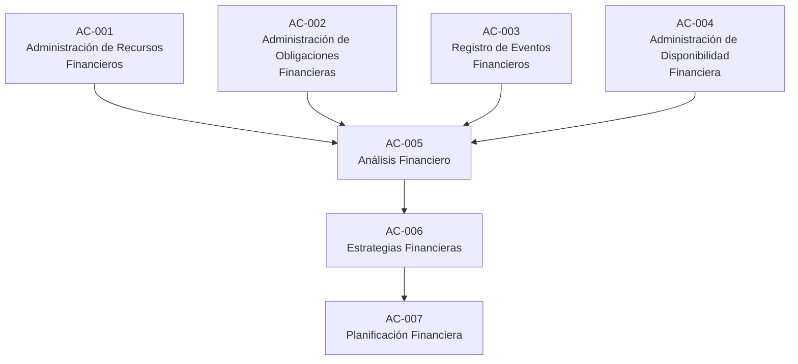

# BudgetKeep

# Solution Architecture Specification

Versión: 1.0

Estado: Approved

Clasificación: Documento de Arquitectura

Document ID: SA-001

Owner: Solution Architecture

---
# 1. Información del documento

| Campo | Valor |
|-------|-------|
| Producto | BudgetKeep |
| Artefacto | Solution Architecture Specification |
| Identificador | SA-001 |
| Estado | Approved |
| Metodología | AI MineSoftware |
| Especialista responsable | SA-001 – Solution Architecture Expert |
| Documento de entrada | Product Vision v1.1, Business Analysis Specification v1.0, Business Domain Specification v1.0 |
| Documento de salida | Solution Architecture Specification Approved |

# 2. Introducción

## 2.1 Propósito

El presente documento define la Arquitectura de Solución oficial de BudgetKeep.

Su propósito es transformar la Business Analysis Specification aprobada en una arquitectura de solución completa, consistente e implementable, estableciendo la organización lógica de la solución y las decisiones arquitectónicas necesarias para soportar el desarrollo y evolución del producto.

La Arquitectura de Solución constituye el vínculo entre el análisis de negocio y las disciplinas técnicas del proyecto, proporcionando una visión estructurada de la solución que servirá como base para la Arquitectura Técnica, el diseño de la base de datos, el desarrollo del backend, el desarrollo del frontend y las actividades de aseguramiento de la calidad.

Este documento define la estructura lógica de la solución, los principios arquitectónicos, los componentes principales y sus responsabilidades, preservando en todo momento la trazabilidad con la Product Vision, la Business Analysis Specification y la Business Domain Specification aprobadas.

La Arquitectura de Solución no define tecnologías específicas, decisiones de implementación, modelos físicos de datos, APIs, infraestructura, interfaces de usuario ni estrategias de despliegue. Dichos aspectos serán desarrollados por los especialistas correspondientes durante las siguientes fases del proyecto.

## 2.2 Objetivo

Establecer una Arquitectura de Solución que permita implementar BudgetKeep de manera consistente con la visión del producto y el modelo de negocio aprobados, proporcionando una estructura lógica clara, mantenible, escalable y preparada para su evolución.

La Arquitectura de Solución tiene como objetivo definir la organización general de la solución, identificar sus principales componentes y responsabilidades, establecer las relaciones entre ellos y proporcionar el marco arquitectónico que guiará las decisiones técnicas durante las siguientes fases del proyecto.

Asimismo, esta arquitectura deberá preservar la integridad del modelo de negocio, mantener la trazabilidad con los artefactos aprobados y facilitar la incorporación progresiva de nuevas capacidades funcionales sin comprometer la estabilidad de la solución.

## 2.3 Alcance

La presente Arquitectura de Solución define la estructura lógica general de BudgetKeep y constituye la referencia arquitectónica para todas las disciplinas técnicas involucradas en el desarrollo del producto.

Su alcance comprende la solución completa de BudgetKeep, considerando tanto las capacidades funcionales definidas para el Producto Mínimo Viable (MVP) como aquellas previstas para la evolución futura del producto.

La arquitectura deberá proporcionar una base estable que permita incorporar nuevas capacidades funcionales sin requerir cambios conceptuales en la organización de la solución, preservando la consistencia con la Product Vision, la Business Analysis Specification y la Business Domain Specification aprobadas.

Este documento establece la organización lógica de la solución, sus principales componentes, sus responsabilidades y las relaciones existentes entre ellos.

No forma parte del alcance de este documento la definición de tecnologías específicas, arquitecturas físicas, modelos físicos de datos, diseño de APIs, infraestructura, interfaces de usuario, estrategias de despliegue ni decisiones de implementación, las cuales serán desarrolladas por los especialistas correspondientes en las siguientes fases del proyecto.

## 2.4 Audiencia

La presente Arquitectura de Solución está dirigida a los especialistas y responsables que participan en el diseño, construcción, validación y evolución técnica de BudgetKeep.

Este documento constituye la referencia arquitectónica oficial para las siguientes disciplinas:

- Project Office
- Solution Architecture
- Technical Architecture
- Database Design
- Backend Development
- Frontend Development
- Quality Assurance

Asimismo, este documento podrá ser utilizado como referencia por otras disciplinas del proyecto cuando sea necesario comprender la organización general de la solución o mantener la trazabilidad entre las decisiones de negocio y su implementación técnica.

## 2.5 Documentos de referencia

La presente Arquitectura de Solución se desarrolla utilizando como línea base oficial los siguientes documentos aprobados del proyecto:

- Product Vision v1.1
- Business Analysis Specification v1.0 (BAS-001)
- Business Domain Specification v1.0 (BDS-001)
- Decision Log
- Artifact Naming Standard
- Phase 01 Closure
- Phase 02 Closure

Toda decisión arquitectónica deberá mantener consistencia con estos artefactos y preservar la trazabilidad establecida durante las fases previas del proyecto.

En caso de existir un conflicto entre la Arquitectura de Solución y cualquiera de los documentos de referencia aprobados, prevalecerán las decisiones de negocio definidas por el Project Office hasta que dichas decisiones sean modificadas mediante el proceso formal de gobernanza del proyecto.

# 3. Objetivos Arquitectónicos

La Arquitectura de Solución de BudgetKeep tiene como propósito proporcionar una estructura lógica estable que permita implementar el modelo de negocio aprobado, preservar la integridad de la solución y facilitar su evolución durante todo el ciclo de vida del producto.

Para cumplir dicho propósito, la arquitectura deberá alcanzar los siguientes objetivos:

## OA-001 Preservar el modelo de negocio

Garantizar que la implementación de la solución respete íntegramente la Product Vision, la Business Analysis Specification y la Business Domain Specification aprobadas, evitando que decisiones técnicas alteren el comportamiento definido por el negocio.

---

## OA-002 Proporcionar una estructura lógica coherente

Organizar la solución mediante componentes claramente definidos, con responsabilidades específicas y relaciones bien delimitadas, facilitando la comprensión, mantenimiento y evolución del sistema.

---

## OA-003 Mantener la trazabilidad

Permitir que cada componente arquitectónico pueda relacionarse con los Procesos de Negocio, Reglas de Negocio, Conceptos del Dominio, Capacidades Funcionales y Requerimientos Funcionales definidos durante el análisis de negocio.

---

## OA-004 Facilitar la evolución del producto

Proporcionar una arquitectura preparada para incorporar nuevas capacidades funcionales sin requerir cambios conceptuales en la organización general de la solución.

---

## OA-005 Favorecer la mantenibilidad

Promover una separación clara de responsabilidades entre los distintos componentes de la solución para facilitar su mantenimiento, extensión y evolución.

---

## OA-006 Preservar la integridad del Financial Reality Model

Garantizar que toda la solución proteja la consistencia e integridad del Financial Reality Model, asegurando que las recomendaciones y análisis generados por BudgetKeep se fundamenten siempre en una representación confiable de la realidad financiera del usuario.

---

## OA-007 Servir como base para la Arquitectura Técnica

Proporcionar el marco arquitectónico que permitirá a las siguientes disciplinas del proyecto definir las decisiones técnicas necesarias para implementar la solución sin comprometer la consistencia del modelo de negocio.

# 4. Principios Arquitectónicos

Los Principios Arquitectónicos establecen las reglas que deberán gobernar todas las decisiones de arquitectura durante el diseño, construcción y evolución de BudgetKeep.

Estos principios complementan los principios definidos en la Product Vision y proporcionan el marco arquitectónico que deberán respetar las disciplinas técnicas del proyecto.

---

## PA-001 La arquitectura implementa el negocio

La arquitectura deberá implementar el modelo de negocio aprobado sin modificar su comportamiento ni incorporar reglas de negocio adicionales.

Las decisiones arquitectónicas deberán preservar íntegramente la Product Vision, la Business Analysis Specification y la Business Domain Specification.

---

## PA-002 El dominio constituye el núcleo de la solución

La organización de la solución deberá construirse alrededor de los Conceptos del Dominio y sus relaciones.

Los componentes técnicos deberán adaptarse al modelo del negocio y no al contrario.

---

## PA-003 Separación clara de responsabilidades

Cada componente arquitectónico deberá tener una responsabilidad claramente definida, evitando duplicidad de funciones y reduciendo el acoplamiento entre componentes.

---

## PA-004 Un único origen de la verdad

Cada elemento de información deberá tener una única fuente oficial dentro de la solución.

La arquitectura deberá evitar la duplicación de datos, reglas de negocio y responsabilidades.

---

## PA-005 Evolución controlada

La arquitectura deberá permitir la incorporación de nuevas capacidades funcionales sin afectar el comportamiento existente ni requerir cambios conceptuales en la organización de la solución.

---

## PA-006 Independencia tecnológica

La estructura de la solución deberá permanecer independiente de tecnologías específicas, permitiendo que las decisiones técnicas evolucionen sin modificar la arquitectura lógica ni el modelo del negocio.

---

## PA-007 Trazabilidad permanente

Toda decisión arquitectónica deberá poder relacionarse con los artefactos aprobados durante las fases anteriores del proyecto, garantizando la trazabilidad entre el negocio y la solución.

---

## PA-008 Consistencia del modelo

Toda operación implementada por la solución deberá preservar la consistencia del Financial Reality Model y del resto de los Conceptos del Dominio definidos para BudgetKeep.

---

## PA-009 Preparación para la evolución

La arquitectura deberá diseñarse considerando la visión completa del producto, permitiendo que futuras capacidades funcionales se incorporen reutilizando la estructura existente y evitando rediseños arquitectónicos significativos.

# 5. Drivers Arquitectónicos

Los Drivers Arquitectónicos representan los factores provenientes del negocio que condicionan el diseño de la Arquitectura de Solución.

Estos elementos influyen directamente en las decisiones arquitectónicas y deberán considerarse durante todas las fases posteriores del proyecto.

---

## AD-001 Preservar el Financial Reality Model

La arquitectura deberá garantizar la integridad, consistencia y confiabilidad del Financial Reality Model, ya que constituye el núcleo sobre el cual BudgetKeep construye sus análisis, recomendaciones y estrategias financieras.

---

## AD-002 Mantener la trazabilidad entre negocio y solución

La arquitectura deberá permitir relacionar cada componente de la solución con los Procesos de Negocio, Reglas de Negocio, Conceptos del Dominio, Capacidades Funcionales y Requerimientos Funcionales definidos durante el análisis.

---

## AD-003 Soportar la evolución progresiva del producto

La solución deberá diseñarse para incorporar nuevas capacidades funcionales sin requerir cambios conceptuales en la arquitectura ni afectar el comportamiento existente.

---

## AD-004 Proteger la independencia del modelo de negocio

La estructura de la solución deberá evitar que decisiones técnicas condicionen o modifiquen el modelo de negocio aprobado.

---

## AD-005 Soportar el modelo financiero multimoneda

La arquitectura deberá permitir implementar de forma consistente el soporte para múltiples monedas, preservando la moneda original de la información financiera y facilitando su análisis consolidado mediante una Moneda Base.

---

## AD-006 Mantener la IA desacoplada del núcleo del negocio

La Inteligencia Artificial deberá consumir la información del modelo de negocio para generar recomendaciones y estrategias, sin convertirse en la fuente de verdad de la solución ni modificar automáticamente la información registrada por el Usuario.

---

## AD-007 Facilitar la incorporación de nuevas capacidades

La arquitectura deberá organizar la solución de manera que futuras capacidades funcionales puedan integrarse reutilizando la estructura existente y minimizando el impacto sobre los componentes ya implementados.

# 6. Restricciones Arquitectónicas

Las Restricciones Arquitectónicas establecen los límites que deberán respetarse durante el diseño, implementación y evolución de la solución para garantizar la consistencia con la arquitectura aprobada y con la línea base del proyecto.

---

## AR-001 Preservar la línea base de negocio

La arquitectura no deberá modificar ni reinterpretar las decisiones establecidas en la Product Vision, la Business Analysis Specification, la Business Domain Specification ni el Decision Log aprobados.

---

## AR-002 Mantener un único modelo del dominio

Toda la solución deberá utilizar el Business Domain Model aprobado como única representación oficial del dominio de negocio.

No deberán existir modelos paralelos que dupliquen o contradigan los Conceptos del Dominio.

---

## AR-003 Separar el negocio de la tecnología

La organización lógica de la solución deberá permanecer independiente de las tecnologías utilizadas para su implementación.

Las decisiones tecnológicas no deberán modificar la estructura arquitectónica ni el comportamiento del negocio.

---

## AR-004 Preservar la integridad del Financial Reality Model

Toda operación implementada por la solución deberá garantizar la consistencia del Financial Reality Model y evitar que existan estados inconsistentes o información contradictoria.

---

## AR-005 Mantener la trazabilidad

Cada componente arquitectónico deberá poder relacionarse con los artefactos de negocio que implementa, preservando la trazabilidad definida por la metodología AI MineSoftware.

---

## AR-006 Evitar duplicidad de responsabilidades

La arquitectura deberá asignar una única responsabilidad principal a cada componente de la solución, evitando duplicidad de funciones y dependencias innecesarias.

---

## AR-007 Preparar la solución para la evolución

La incorporación de nuevas capacidades funcionales deberá realizarse reutilizando la arquitectura existente siempre que sea posible, evitando rediseños conceptuales que comprometan la estabilidad de la solución.

# 7. Visión General de la Arquitectura

La Arquitectura de Solución de BudgetKeep organiza el producto como un conjunto de componentes especializados que colaboran para implementar el modelo de negocio definido durante las fases de Product Discovery y Business Analysis.

La solución se estructura alrededor del Business Domain Model, el cual constituye el núcleo funcional del producto y representa la fuente oficial de conocimiento del negocio.

Todos los componentes de la solución interactúan de manera coordinada para registrar, mantener, analizar y presentar la Realidad Financiera del Usuario, preservando en todo momento la integridad del Financial Reality Model.

La organización de la solución responde a los siguientes criterios arquitectónicos:

- el modelo del dominio constituye el núcleo de la solución;
- las responsabilidades se distribuyen entre componentes especializados;
- cada componente posee una responsabilidad claramente definida;
- la colaboración entre componentes permite implementar los procesos de negocio definidos para BudgetKeep;
- la arquitectura facilita la incorporación progresiva de nuevas capacidades funcionales sin modificar la organización general de la solución;
- las decisiones técnicas de implementación deberán respetar esta organización arquitectónica.

La presente Arquitectura de Solución define la estructura lógica del producto. La forma en que dicha estructura será implementada mediante tecnologías, componentes físicos o mecanismos de integración será definida posteriormente durante la fase de Arquitectura Técnica.

# 8. Componentes Arquitectónicos

La Arquitectura de Solución organiza BudgetKeep mediante Componentes Arquitectónicos que implementan las Capacidades Funcionales definidas durante la Business Analysis Specification.

Cada Componente Arquitectónico representa una unidad lógica de la solución con una responsabilidad claramente delimitada y deberá implementar una o varias Capacidades Funcionales relacionadas.

La correspondencia entre Componentes Arquitectónicos y Capacidades Funcionales no implica necesariamente una relación uno a uno. Un Componente Arquitectónico podrá implementar una o varias Capacidades Funcionales relacionadas, de acuerdo con las necesidades de la Arquitectura de Solución.

La colaboración entre estos componentes permitirá implementar los procesos de negocio y preservar la consistencia del Business Domain Model.

Los Componentes Arquitectónicos identificados para BudgetKeep son:

- Componente de Administración de Recursos Financieros.
- Componente de Administración de Obligaciones Financieras.
- Componente de Registro de Eventos Financieros.
- Componente de Administración de la Disponibilidad Financiera.
- Componente de Análisis Financiero.
- Componente de Estrategias Financieras.
- Componente de Planificación Financiera.

Cada uno de estos componentes será responsable de implementar las Capacidades Funcionales correspondientes y colaborará con los demás componentes para mantener la consistencia de la solución y preservar la integridad del Financial Reality Model.

La definición detallada de las responsabilidades y relaciones de cada componente se desarrolla en las secciones siguientes de este documento.

## 8.1 Identificación de Componentes Arquitectónicos

Con el propósito de mantener la trazabilidad entre la Arquitectura de Solución y las fases posteriores del proyecto, cada Componente Arquitectónico posee un identificador único.

Estos identificadores serán utilizados como referencia por la Arquitectura Técnica, el Diseño de Base de Datos, el Desarrollo Backend, el Desarrollo Frontend y Quality Assurance.

**Tabla SA-001-01. Componentes Arquitectónicos**

| ID | Componente Arquitectónico |
|----|---------------------------|
| AC-001 | Administración de Recursos Financieros |
| AC-002 | Administración de Obligaciones Financieras |
| AC-003 | Registro de Eventos Financieros |
| AC-004 | Administración de Disponibilidad Financiera |
| AC-005 | Análisis Financiero |
| AC-006 | Estrategias Financieras |
| AC-007 | Planificación Financiera |

# 9. Responsabilidades Arquitectónicas

Cada Componente Arquitectónico posee una responsabilidad claramente definida dentro de la solución. La correcta asignación de responsabilidades permite mantener una alta cohesión, reducir el acoplamiento entre componentes y facilitar la evolución del producto.

Las responsabilidades identificadas para los Componentes Arquitectónicos de BudgetKeep son las siguientes:

**Tabla SA-001-02. Responsabilidades Arquitectónicas**

| ID | Componente Arquitectónico | Responsabilidad Principal |
|----|---------------------------|---------------------------|
| AC-001 | Administración de Recursos Financieros | Gestionar los Recursos Financieros registrados por el Usuario y mantener la información necesaria para su utilización dentro del Financial Reality Model. |
| AC-002 | Administración de Obligaciones Financieras | Gestionar las Obligaciones Financieras del Usuario durante todo su ciclo de vida, preservando su consistencia, estado y relación con el Financial Reality Model. |
| AC-003 | Registro de Eventos Financieros | Registrar los Eventos Financieros que afectan la Realidad Financiera del Usuario y asegurar su correcta incorporación al Financial Reality Model. |
| AC-004 | Administración de Disponibilidad Financiera | Determinar y mantener la Disponibilidad Financiera del Usuario utilizando la información consolidada del Financial Reality Model para apoyar los procesos de análisis y planificación. |
| AC-005 | Análisis Financiero | Analizar la información contenida en el Financial Reality Model para generar indicadores, escenarios y elementos de apoyo a la toma de decisiones. |
| AC-006 | Estrategias Financieras | Generar recomendaciones y estrategias financieras fundamentadas en la información disponible dentro del Financial Reality Model, respetando el principio de que la IA recomienda y el Usuario decide. |
| AC-007 | Planificación Financiera | Administrar los planes financieros definidos por el Usuario y dar seguimiento a las decisiones adoptadas para alcanzar sus objetivos financieros, utilizando como base la información del Financial Reality Model. |

Cada componente deberá limitarse a su responsabilidad principal y colaborar con los demás componentes únicamente mediante las relaciones arquitectónicas definidas en este documento.

La implementación detallada de las funcionalidades correspondientes a cada componente será desarrollada en las fases posteriores del proyecto.

# 10. Relaciones Arquitectónicas

Los Componentes Arquitectónicos colaboran entre sí para implementar las Capacidades Funcionales de BudgetKeep, preservando la integridad del modelo de negocio y manteniendo una clara separación de responsabilidades.

Las relaciones definidas en esta arquitectura representan dependencias funcionales entre Componentes Arquitectónicos y no establecen mecanismos específicos de comunicación, tecnologías de integración ni decisiones de implementación.

## 10.1 Diagrama de Componentes Arquitectónicos

La Figura SA-001-01 presenta la organización lógica de los Componentes Arquitectónicos identificados para BudgetKeep.

El diagrama representa exclusivamente la Arquitectura de Solución y muestra las principales relaciones de colaboración entre los Componentes Arquitectónicos.

No representa tecnologías, mecanismos de integración, infraestructura, bases de datos, APIs ni decisiones de implementación.

**Figura SA-001-01. Diagrama de Componentes Arquitectónicos**

## 10.2 Relaciones entre Componentes Arquitectónicos

La Tabla SA-001-03 describe las principales relaciones de colaboración existentes entre los Componentes Arquitectónicos.

**Tabla SA-001-03. Relaciones entre Componentes Arquitectónicos**

| Componente (ID) | Se relaciona con | Propósito de la relación |
|-----------------|------------------|--------------------------|
| AC-001 Administración de Recursos Financieros | AC-005 Análisis Financiero | Proporcionar la información financiera relacionada con los Recursos Financieros para su análisis. |
| AC-002 Administración de Obligaciones Financieras | AC-005 Análisis Financiero | Proporcionar la información correspondiente a las Obligaciones Financieras para su análisis. |
| AC-003 Registro de Eventos Financieros | AC-005 Análisis Financiero | Proporcionar los Eventos Financieros registrados que afectan la situación financiera del Usuario. |
| AC-004 Administración de Disponibilidad Financiera | AC-005 Análisis Financiero | Proporcionar la Disponibilidad Financiera calculada para apoyar el análisis financiero. |
| AC-005 Análisis Financiero | AC-006 Estrategias Financieras | Proporcionar indicadores, escenarios y resultados analíticos utilizados para generar estrategias financieras. |
| AC-006 Estrategias Financieras | AC-007 Planificación Financiera | Proporcionar recomendaciones y estrategias que servirán como base para la elaboración y seguimiento de los planes financieros. |

## 10.3 Consideraciones Arquitectónicas

Las relaciones definidas en esta sección representan únicamente dependencias lógicas entre Componentes Arquitectónicos.

La definición de interfaces, mecanismos de comunicación, protocolos, contratos de integración, intercambio de datos y demás aspectos técnicos será responsabilidad de la Arquitectura Técnica (TA-001).

La relación entre los Componentes Arquitectónicos y el Business Domain Model será documentada posteriormente mediante un diagrama específico de trazabilidad arquitectónica.

# 11. Trazabilidad Arquitectónica

La Arquitectura de Solución constituye el vínculo entre los artefactos de negocio y las disciplinas técnicas del proyecto.

Cada Componente Arquitectónico identificado mediante un código AC implementa una o varias Capacidades Funcionales definidas durante la Business Analysis Specification y mantiene una relación directa con los Procesos de Negocio, Reglas de Negocio y Conceptos del Dominio correspondientes.

La trazabilidad arquitectónica deberá preservar la relación entre los siguientes niveles de la solución:

- Product Vision
- Business Processes (BP)
- Business Rules (BR)
- Domain Concepts (DC)
- Functional Capabilities (FC)
- Functional Requirements (FR)
- Architectural Components (AC)

Esta estructura permitirá mantener una correspondencia verificable entre las decisiones de negocio y la organización lógica de la solución, facilitando el análisis de impacto, la evolución del producto y la validación de la implementación durante las siguientes fases del proyecto.

Los identificadores AC definidos en este documento constituyen la referencia oficial para los Componentes Arquitectónicos durante las fases posteriores del proyecto y deberán utilizarse para mantener la trazabilidad entre los artefactos de Arquitectura Técnica, Diseño de Base de Datos, Desarrollo Backend, Desarrollo Frontend y Quality Assurance.

La definición detallada de la matriz de trazabilidad será desarrollada y mantenida durante las fases posteriores del proyecto conforme evolucione la solución.

# 12. Riesgos Arquitectónicos

La presente Arquitectura de Solución identifica los principales riesgos que podrían comprometer la consistencia de la solución durante las fases posteriores del proyecto.

La identificación temprana de estos riesgos permitirá que las decisiones técnicas preserven la integridad de la arquitectura aprobada.

**Tabla SA-001-04. Riesgos Arquitectónicos**

| ID | Riesgo Arquitectónico | Impacto | Mitigación |
|----|-----------------------|----------|------------|
| ARK-001 | Modificación del modelo de negocio durante la implementación técnica. | Alto | Mantener la trazabilidad entre los artefactos de negocio y los Componentes Arquitectónicos. |
| ARK-002 | Duplicidad de responsabilidades entre Componentes Arquitectónicos. | Alto | Respetar la asignación de responsabilidades definida en este documento. |
| ARK-003 | Pérdida de trazabilidad entre negocio, arquitectura y desarrollo. | Alto | Utilizar los identificadores oficiales (BP, BR, DC, FC, FR y AC) en todos los artefactos posteriores. |
| ARK-004 | Acoplamiento excesivo entre Componentes Arquitectónicos. | Medio | Mantener una clara separación de responsabilidades y limitar las dependencias entre componentes. |
| ARK-005 | Incorporación de decisiones técnicas que alteren la Arquitectura de Solución. | Alto | Toda decisión técnica deberá respetar la Arquitectura de Solución aprobada y será responsabilidad de la Arquitectura Técnica (TA-001). |

Los riesgos identificados deberán revisarse durante las siguientes fases del proyecto para asegurar que las decisiones de diseño e implementación permanezcan alineadas con la Arquitectura de Solución aprobada.

# 13. Conclusiones

La presente Arquitectura de Solución transforma la línea base de negocio aprobada durante las fases de Product Discovery y Business Analysis en una organización lógica de la solución, preservando en todo momento las decisiones de negocio previamente aprobadas.

La arquitectura definida en este documento establece los Componentes Arquitectónicos, sus responsabilidades, sus relaciones y los principios necesarios para garantizar una evolución consistente del producto.

La presente Arquitectura de Solución no define tecnologías, mecanismos de implementación, infraestructura, bases de datos ni decisiones de desarrollo, las cuales serán responsabilidad de las disciplinas técnicas correspondientes.

Con la aprobación de este documento, la solución dispone de una organización arquitectónica suficientemente definida para iniciar la fase de Arquitectura Técnica.

## Entregables para la siguiente fase

La Arquitectura Técnica (TA-001) utilizará como línea base los siguientes elementos definidos en este documento:

- Objetivos Arquitectónicos.
- Principios Arquitectónicos.
- Drivers Arquitectónicos.
- Restricciones Arquitectónicas.
- Componentes Arquitectónicos (AC).
- Responsabilidades Arquitectónicas.
- Relaciones Arquitectónicas.
- Riesgos Arquitectónicos.

Toda decisión técnica deberá preservar la consistencia de la Arquitectura de Solución aprobada y mantener la trazabilidad con los artefactos definidos durante las fases anteriores del proyecto.