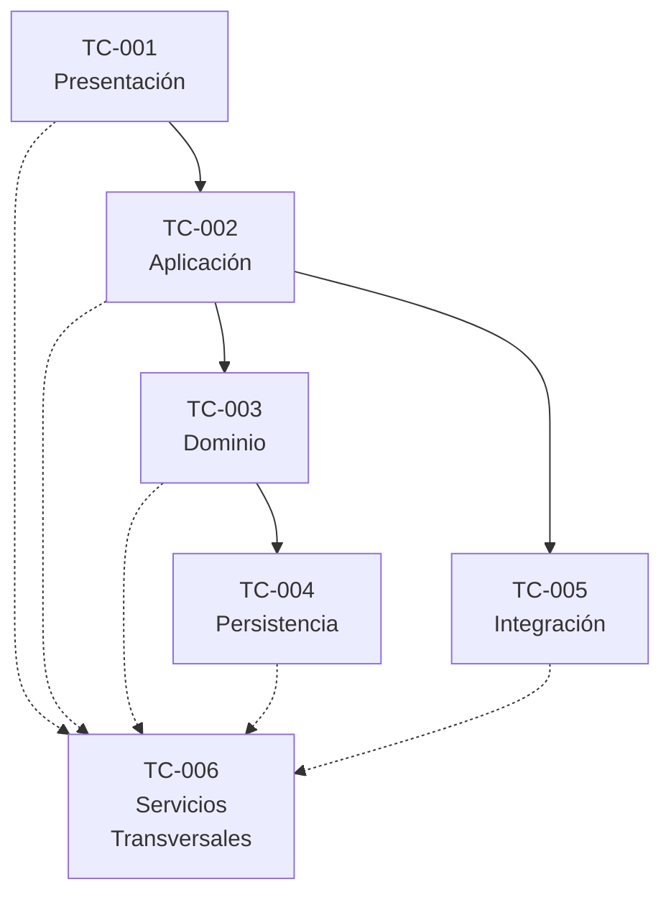

# BudgetKeep

# Technical Architecture Specification

Versión: 1.0

Estado: Draft

Clasificación: Documento de Arquitectura Técnica

Document ID: TA-001

Owner: Technical Architecture

---

# 1. Información del documento

| Campo | Valor |
|-------|-------|
| Producto | BudgetKeep |
| Artefacto | Technical Architecture Specification |
| Identificador | TA-001 |
| Estado | Draft |
| Metodología | AI MineSoftware |
| Especialista responsable | TA-001 – Technical Architecture Expert |
| Documento de entrada | Solution Architecture Specification v1.0 |
| Documento de salida | Technical Architecture Specification Approved |

# 2. Introducción

## 2.1 Propósito

El presente documento define la Arquitectura Técnica oficial de BudgetKeep.

Su propósito es transformar la Arquitectura de Solución aprobada en una Arquitectura Técnica consistente, implementable y trazable, estableciendo la organización técnica de la solución y las decisiones técnicas necesarias para guiar las siguientes disciplinas del proyecto.

La Arquitectura Técnica constituye el vínculo entre la Arquitectura de Solución y las disciplinas responsables del diseño detallado, implementación y despliegue del producto, proporcionando un marco técnico común que preserve la integridad de la arquitectura aprobada y del modelo de negocio.

Este documento define la organización técnica de la solución, los principios técnicos, los estándares, los patrones arquitectónicos, las decisiones técnicas transversales y los criterios de trazabilidad que deberán respetarse durante el desarrollo y evolución de BudgetKeep.

La Arquitectura Técnica no define diseños físicos de bases de datos, interfaces de usuario, APIs específicas, infraestructura, configuraciones de despliegue ni detalles propios de implementación, los cuales serán desarrollados por los especialistas correspondientes durante las siguientes fases del proyecto.

## 2.2 Objetivo

Establecer una Arquitectura Técnica que proporcione una base consistente para la implementación de BudgetKeep, preservando la Arquitectura de Solución aprobada y garantizando que las decisiones técnicas mantengan la integridad del modelo de negocio, la trazabilidad entre los artefactos del proyecto y la capacidad de evolución del producto.

Asimismo, esta arquitectura deberá proporcionar lineamientos técnicos comunes para todas las disciplinas de implementación, promoviendo la separación de responsabilidades, la mantenibilidad, la escalabilidad y la consistencia técnica de la solución.

## 2.3 Alcance

La presente Arquitectura Técnica define la organización técnica general de BudgetKeep y constituye la referencia oficial para todas las disciplinas responsables de la implementación del producto.

Su alcance comprende la definición de principios técnicos, criterios de organización, estándares, patrones arquitectónicos, decisiones técnicas transversales y mecanismos de trazabilidad necesarios para implementar la Arquitectura de Solución aprobada.

Este documento no forma parte del diseño detallado de las disciplinas especializadas y, por lo tanto, no define modelos físicos de datos, APIs, componentes de infraestructura, mecanismos de despliegue, interfaces de usuario ni decisiones específicas de implementación tecnológica.

Dichos elementos serán desarrollados posteriormente por los especialistas correspondientes, utilizando esta Arquitectura Técnica como referencia obligatoria.

## 2.4 Audiencia

La presente Arquitectura Técnica está dirigida a los especialistas y responsables que participarán en el diseño detallado, implementación, validación y evolución técnica de BudgetKeep.

Este documento constituye la referencia técnica oficial para las siguientes disciplinas:

- Project Office
- Technical Architecture
- Database Design
- Backend Development
- Frontend Development
- Infrastructure
- Security
- DevOps
- Quality Assurance

Asimismo, podrá utilizarse como referencia por otras disciplinas cuando sea necesario comprender la organización técnica de la solución o mantener la trazabilidad con los artefactos aprobados del proyecto.

## 2.5 Documentos de referencia

La presente Arquitectura Técnica se desarrolla utilizando como línea base oficial los siguientes documentos aprobados del proyecto:

- Product Vision v1.1
- Business Analysis Specification v1.0 (BAS-001)
- Business Domain Specification v1.0 (BDS-001)
- Solution Architecture Specification v1.0 (SA-001)
- Decision Log
- Phase 01 Closure
- Phase 02 Closure
- Phase 03 Closure

Toda decisión técnica deberá mantener consistencia con estos artefactos y preservar la trazabilidad definida por la metodología AI MineSoftware.

En caso de existir un conflicto entre una decisión técnica y cualquiera de los documentos de referencia aprobados, prevalecerán las decisiones definidas por la Arquitectura de Solución y por el Project Office hasta que dichas decisiones sean modificadas mediante el proceso formal de gobernanza del proyecto.

# 3. Objetivos Técnicos

La Arquitectura Técnica de BudgetKeep tiene como propósito proporcionar un marco técnico consistente que permita implementar la Arquitectura de Solución aprobada preservando la integridad del modelo de negocio y facilitando el trabajo coordinado de las disciplinas técnicas involucradas en el desarrollo del producto.

Para cumplir dicho propósito, la Arquitectura Técnica deberá alcanzar los siguientes objetivos:

## TO-001 Preservar la Arquitectura de Solución

Garantizar que todas las decisiones técnicas implementen la Arquitectura de Solución aprobada sin modificar su organización lógica, responsabilidades ni relaciones entre Componentes Arquitectónicos.

---

## TO-002 Establecer una organización técnica consistente

Definir una organización técnica común que facilite la implementación uniforme de todos los Componentes Arquitectónicos, promoviendo una clara separación de responsabilidades y reduciendo el acoplamiento entre los distintos elementos de la solución.

---

## TO-003 Proporcionar lineamientos técnicos comunes

Definir principios, estándares, patrones y criterios técnicos que deberán ser utilizados por las disciplinas responsables del diseño detallado e implementación del producto.

---

## TO-004 Mantener la trazabilidad técnica

Garantizar que toda decisión técnica pueda relacionarse con los Componentes Arquitectónicos, Capacidades Funcionales, Requerimientos Funcionales y demás artefactos aprobados del proyecto, preservando la trazabilidad establecida por AI MineSoftware.

---

## TO-005 Facilitar la evolución técnica

Proporcionar una base técnica preparada para incorporar nuevas capacidades funcionales y nuevos componentes sin comprometer la estabilidad, mantenibilidad o consistencia de la solución.

---

## TO-006 Favorecer la independencia entre disciplinas

Establecer límites claros entre las responsabilidades de las distintas disciplinas técnicas, permitiendo que cada especialista desarrolle sus entregables de manera coordinada, utilizando una Arquitectura Técnica común como referencia.

---

## TO-007 Servir como referencia para las fases de implementación

Proporcionar el marco técnico que utilizarán las disciplinas de Diseño de Base de Datos, Desarrollo Backend, Desarrollo Frontend, Infraestructura, Seguridad, DevOps y Quality Assurance durante el diseño detallado, implementación, validación y evolución de BudgetKeep.

# 4. Principios Técnicos

Los Principios Técnicos establecen las reglas que deberán gobernar todas las decisiones técnicas durante el diseño detallado, implementación, validación y evolución de BudgetKeep.

Estos principios complementan los Principios Arquitectónicos definidos en la Arquitectura de Solución y proporcionan el marco técnico común que deberán respetar todas las disciplinas responsables de la implementación del producto.

---

## TP-001 La implementación preserva la Arquitectura de Solución

Toda decisión técnica deberá implementar la Arquitectura de Solución aprobada sin modificar su estructura lógica, sus responsabilidades ni las relaciones entre Componentes Arquitectónicos.

---

## TP-002 Una única responsabilidad técnica

Cada componente técnico deberá asumir una única responsabilidad principal, evitando duplicidad de funciones y favoreciendo una alta cohesión y un bajo acoplamiento.

---

## TP-003 Consistencia técnica

Los estándares, patrones y convenciones definidos por la Arquitectura Técnica deberán aplicarse de manera uniforme en toda la solución para garantizar consistencia, mantenibilidad y facilidad de evolución.

---

## TP-004 Independencia entre disciplinas técnicas

Las decisiones correspondientes a una disciplina técnica no deberán invadir las responsabilidades asignadas a otras disciplinas.

Cada especialista desarrollará sus entregables respetando los límites definidos por la Arquitectura Técnica.

---

## TP-005 Evolución controlada

Toda incorporación de nuevas capacidades funcionales deberá reutilizar la organización técnica existente siempre que sea posible, minimizando el impacto sobre los componentes previamente implementados.

---

## TP-006 Trazabilidad permanente

Toda decisión técnica deberá mantener una relación verificable con los Componentes Arquitectónicos, Capacidades Funcionales y Requerimientos Funcionales definidos en los artefactos aprobados del proyecto.

---

## TP-007 Separación entre definición e implementación

La Arquitectura Técnica establece los lineamientos técnicos de la solución, mientras que los detalles de implementación serán responsabilidad de las disciplinas especializadas.

Las decisiones de implementación no deberán modificar los principios, estándares o patrones definidos en este documento.

---

## TP-008 Consistencia del modelo técnico

La organización técnica de la solución deberá preservar en todo momento la integridad del Financial Reality Model y garantizar que las decisiones de implementación no comprometan la consistencia del modelo de negocio aprobado.

---

## TP-009 Preparación para la evolución tecnológica

La Arquitectura Técnica deberá facilitar la incorporación futura de nuevas tecnologías, componentes o mecanismos de implementación sin requerir modificaciones conceptuales en la organización técnica de la solución.

# 5. Drivers Técnicos

Los Drivers Técnicos representan los factores provenientes de la Arquitectura de Solución y de la línea base aprobada que condicionan las decisiones técnicas durante el diseño detallado, la implementación y la evolución de BudgetKeep.

Estos elementos deberán considerarse por todas las disciplinas técnicas para garantizar una implementación consistente, trazable y alineada con la arquitectura aprobada.

---

## TD-001 Preservar la Arquitectura de Solución

Toda decisión técnica deberá implementar la Arquitectura de Solución aprobada sin alterar la organización lógica, las responsabilidades ni las relaciones entre los Componentes Arquitectónicos.

---

## TD-002 Mantener un modelo técnico consistente

La solución deberá organizarse mediante componentes técnicos claramente definidos, promoviendo una alta cohesión, un bajo acoplamiento y una distribución uniforme de responsabilidades.

---

## TD-003 Preservar la trazabilidad técnica

Toda decisión técnica deberá mantener una relación verificable con los Componentes Arquitectónicos, las Capacidades Funcionales y los Requerimientos Funcionales definidos en los artefactos aprobados.

---

## TD-004 Facilitar el trabajo de las disciplinas técnicas

La Arquitectura Técnica deberá proporcionar un marco común que permita a las distintas disciplinas desarrollar sus entregables de manera independiente, preservando la consistencia global de la solución.

---

## TD-005 Favorecer la mantenibilidad

La organización técnica deberá facilitar la evolución, mantenimiento y extensión del producto mediante la aplicación uniforme de principios, estándares y patrones técnicos.

---

## TD-006 Proteger la integridad del Financial Reality Model

Toda implementación deberá preservar la consistencia del Financial Reality Model y evitar que las decisiones técnicas comprometan la integridad del modelo de negocio.

---

## TD-007 Preparar la evolución técnica del producto

La Arquitectura Técnica deberá facilitar la incorporación progresiva de nuevas capacidades funcionales, componentes técnicos y mecanismos de implementación sin requerir modificaciones conceptuales en la organización técnica de la solución.

# 6. Restricciones Técnicas

Las Restricciones Técnicas establecen los límites que deberán respetarse durante el diseño detallado, implementación, validación y evolución de BudgetKeep para garantizar la consistencia con la Arquitectura de Solución aprobada y preservar la línea base del proyecto.

---

## TR-001 Preservar la línea base arquitectónica

Las decisiones técnicas no deberán modificar la Product Vision, la Business Analysis Specification, la Business Domain Specification ni la Arquitectura de Solución aprobadas.

---

## TR-002 Mantener la organización técnica definida

Toda implementación deberá respetar la organización técnica establecida por esta Arquitectura Técnica.

No deberán incorporarse componentes, responsabilidades o dependencias que contradigan la organización técnica definida en este documento.

---

## TR-003 Respetar la separación de responsabilidades

Cada disciplina técnica deberá limitarse a las responsabilidades que le correspondan dentro del proyecto.

Las decisiones de una disciplina no deberán sustituir ni redefinir las responsabilidades asignadas a otra.

---

## TR-004 Preservar la integridad del modelo de negocio

Ninguna decisión técnica podrá alterar el comportamiento definido por las Reglas de Negocio, los Procesos de Negocio o los Conceptos del Dominio aprobados.

---

## TR-005 Mantener la trazabilidad

Toda decisión técnica deberá poder relacionarse con los Componentes Arquitectónicos, Capacidades Funcionales y Requerimientos Funcionales definidos en los artefactos oficiales del proyecto.

---

## TR-006 Evitar duplicidad de responsabilidades técnicas

La solución deberá evitar componentes técnicos con responsabilidades superpuestas o duplicadas.

Cada responsabilidad técnica deberá tener un único propietario claramente identificado.

---

## TR-007 Favorecer la evolución controlada

Las futuras capacidades funcionales deberán incorporarse reutilizando la organización técnica existente siempre que sea posible.

Las modificaciones estructurales deberán justificarse mediante el proceso formal de gobernanza del proyecto.

---

## TR-008 Mantener independencia tecnológica

La Arquitectura Técnica no deberá depender de una tecnología específica.

Las decisiones tecnológicas serán definidas posteriormente por las disciplinas especializadas respetando los lineamientos establecidos en este documento.

---

## TR-009 Preservar la consistencia técnica

Los estándares, patrones y decisiones definidos por la Arquitectura Técnica deberán aplicarse de forma uniforme en toda la solución para garantizar un comportamiento consistente entre los distintos componentes técnicos.

# 7. Arquitectura Técnica General

## 7.1 Objetivo

La Arquitectura Técnica General establece la organización técnica que deberán utilizar todas las disciplinas responsables de la implementación de BudgetKeep.

Su propósito consiste en proporcionar una estructura técnica uniforme que preserve la Arquitectura de Solución aprobada, facilite la colaboración entre especialistas y permita evolucionar la solución de forma consistente.

La Arquitectura Técnica no sustituye la Arquitectura de Solución.

La complementa proporcionando la organización técnica que servirá como referencia para el diseño detallado, la implementación, las pruebas y la evolución del producto.

---

## 7.2 Organización Técnica de la Solución

BudgetKeep se organizará mediante un conjunto de capas técnicas con responsabilidades claramente delimitadas.

Cada capa deberá colaborar con las demás respetando los principios, restricciones y estándares definidos por la presente Arquitectura Técnica.

La organización técnica deberá favorecer:

- alta cohesión;
- bajo acoplamiento;
- separación de responsabilidades;
- reutilización;
- mantenibilidad;
- escalabilidad;
- evolución controlada.

---

## 7.3 Capas Técnicas

La solución se organizará mediante las siguientes capas técnicas:

- Capa de Presentación.
- Capa de Aplicación.
- Capa de Dominio.
- Capa de Persistencia.
- Capa de Integración.
- Capa de Servicios Transversales.

Estas capas representan una organización técnica.

No representan tecnologías específicas, componentes físicos ni mecanismos de despliegue.

La definición detallada de cada una será desarrollada por las disciplinas técnicas correspondientes respetando la presente Arquitectura Técnica.

---

## 7.4 Responsabilidad de las Capas

Cada capa deberá asumir una responsabilidad claramente definida.

Ninguna capa deberá implementar responsabilidades pertenecientes a otra.

La colaboración entre capas deberá realizarse únicamente mediante los mecanismos definidos por las disciplinas responsables de su implementación.

---

## 7.5 Dependencias Técnicas

Las dependencias entre capas deberán minimizar el acoplamiento entre componentes.

Toda dependencia deberá justificarse por una necesidad funcional o técnica claramente identificada.

No deberán existir dependencias que comprometan la mantenibilidad, trazabilidad o evolución de la solución.

---

## 7.6 Evolución de la Arquitectura Técnica

La incorporación de nuevas capacidades funcionales deberá reutilizar la organización técnica definida en esta Arquitectura.

Cuando sea necesaria una modificación estructural, ésta deberá realizarse mediante el proceso formal de gobernanza del proyecto y preservar la consistencia con la Arquitectura de Solución aprobada.

# 8. Componentes Técnicos

La Arquitectura Técnica organiza la implementación de BudgetKeep mediante Componentes Técnicos que proporcionan la estructura necesaria para materializar los Componentes Arquitectónicos definidos en la Arquitectura de Solución.

Cada Componente Técnico representa una unidad técnica con responsabilidades claramente delimitadas y constituye la base sobre la cual las disciplinas especializadas desarrollarán sus diseños detallados.

Los Componentes Técnicos no constituyen una segunda arquitectura de la solución ni sustituyen los Componentes Arquitectónicos definidos por la Arquitectura de Solución.

Su propósito consiste en proporcionar una organización técnica transversal que sirva como referencia para las disciplinas responsables del diseño detallado, la implementación, la validación y la evolución del producto.

Los Componentes Arquitectónicos continúan representando la organización lógica de la solución.

Los Componentes Técnicos representan la organización técnica utilizada para implementar dicha arquitectura de manera consistente.

La definición de estos componentes no implica tecnologías específicas ni mecanismos concretos de implementación.

---

## 8.1 Identificación de Componentes Técnicos

Con el propósito de mantener la trazabilidad entre la Arquitectura Técnica y las disciplinas posteriores, cada Componente Técnico posee un identificador único.

Estos identificadores serán utilizados como referencia por las especificaciones de Diseño de Base de Datos, Desarrollo Backend, Desarrollo Frontend, Infraestructura, Seguridad, DevOps y Quality Assurance.

**Tabla TA-001-01. Componentes Técnicos**

| ID | Componente Técnico |
|----|---------------------|
| TC-001 | Presentación |
| TC-002 | Aplicación |
| TC-003 | Dominio |
| TC-004 | Persistencia |
| TC-005 | Integración |
| TC-006 | Servicios Transversales |

---

## 8.2 Relación con la Arquitectura de Solución

Los Componentes Técnicos constituyen la estructura técnica utilizada para implementar los Componentes Arquitectónicos definidos en la Arquitectura de Solución.

Un mismo Componente Técnico podrá colaborar en la implementación de uno o varios Componentes Arquitectónicos, dependiendo de las necesidades de cada Capacidad Funcional.

La correspondencia entre Componentes Arquitectónicos y Componentes Técnicos no representa una relación uno a uno.

Su propósito consiste en preservar la separación entre la organización lógica definida por la Arquitectura de Solución y la organización técnica utilizada durante la implementación.

La trazabilidad detallada entre ambos niveles será documentada en la sección correspondiente de este documento.

## 8.3 Trazabilidad entre Componentes Arquitectónicos y Componentes Técnicos

Los Componentes Técnicos proporcionan la organización técnica utilizada para implementar los Componentes Arquitectónicos definidos por la Arquitectura de Solución.

La siguiente matriz presenta la correspondencia general entre ambos niveles de abstracción.

**Tabla TA-001-02. Trazabilidad AC ↔ TC**

| Componente Arquitectónico | Componentes Técnicos involucrados |
|----------------------------|-----------------------------------|
| AC-001 Administración de Recursos Financieros | TC-001, TC-002, TC-003, TC-004 |
| AC-002 Administración de Obligaciones Financieras | TC-001, TC-002, TC-003, TC-004 |
| AC-003 Registro de Eventos Financieros | TC-001, TC-002, TC-003, TC-004 |
| AC-004 Administración de Disponibilidad Financiera | TC-002, TC-003, TC-004 |
| AC-005 Análisis Financiero | TC-002, TC-003, TC-004 |
| AC-006 Estrategias Financieras | TC-002, TC-003, TC-005, TC-006 |
| AC-007 Planificación Financiera | TC-001, TC-002, TC-003, TC-004, TC-006 |

La presente matriz representa una relación de trazabilidad entre la Arquitectura de Solución y la Arquitectura Técnica.

No representa dependencias de implementación ni relaciones uno a uno entre Componentes Arquitectónicos y Componentes Técnicos.

# 9. Responsabilidades Técnicas

Cada Componente Técnico posee una responsabilidad claramente definida dentro de la Arquitectura Técnica de BudgetKeep.

La correcta asignación de responsabilidades permite mantener una alta cohesión, reducir el acoplamiento entre componentes técnicos y facilitar el trabajo coordinado de las distintas disciplinas de implementación.

Las responsabilidades identificadas para los Componentes Técnicos son las siguientes:

**Tabla TA-001-02. Responsabilidades Técnicas**

| ID | Componente Técnico | Responsabilidad Principal |
|----|---------------------|---------------------------|
| TC-001 | Presentación | Gestionar la interacción entre el Usuario y la solución, presentando la información y capturando las acciones del Usuario sin incorporar reglas de negocio. |
| TC-002 | Aplicación | Coordinar la ejecución de los casos de uso del producto, orquestando la colaboración entre los distintos Componentes Técnicos necesarios para implementar cada Capacidad Funcional. |
| TC-003 | Dominio | Implementar el comportamiento del modelo de negocio definido por los artefactos aprobados, preservando la consistencia del Financial Reality Model y de los Conceptos del Dominio. |
| TC-004 | Persistencia | Administrar el almacenamiento y recuperación de la información utilizada por la solución, preservando la integridad y consistencia de los datos. |
| TC-005 | Integración | Administrar la comunicación entre BudgetKeep y componentes o servicios externos cuando sea requerido por la solución. |
| TC-006 | Servicios Transversales | Proporcionar capacidades técnicas reutilizables que puedan ser utilizadas por los distintos Componentes Técnicos sin modificar sus responsabilidades principales. |

Cada Componente Técnico deberá limitarse a su responsabilidad principal y colaborar con los demás Componentes Técnicos únicamente mediante las relaciones definidas por la presente Arquitectura Técnica.

La implementación detallada de estas responsabilidades será desarrollada por las disciplinas técnicas correspondientes durante las siguientes fases del proyecto.

# 10. Relaciones Técnicas

Los Componentes Técnicos colaboran entre sí para implementar los Componentes Arquitectónicos definidos en la Arquitectura de Solución, preservando la separación de responsabilidades y reduciendo el acoplamiento entre las distintas partes de la solución.

Las relaciones definidas en esta sección representan dependencias técnicas entre Componentes Técnicos y establecen los límites que deberán respetarse durante el diseño detallado y la implementación del producto.

## 10.1 Modelo de Dependencias Técnicas

La Arquitectura Técnica de BudgetKeep establece el siguiente modelo general de dependencias entre Componentes Técnicos.

---

## 10.2 Relaciones entre Componentes Técnicos

**Tabla TA-001-03. Relaciones Técnicas**

| Componente Técnico | Se relaciona con | Propósito de la relación |
|--------------------|------------------|--------------------------|
| TC-001 Presentación | TC-002 Aplicación | Solicitar la ejecución de los casos de uso del producto y presentar sus resultados al Usuario. |
| TC-002 Aplicación | TC-003 Dominio | Coordinar la ejecución de las reglas y procesos definidos por el modelo de negocio. |
| TC-002 Aplicación | TC-005 Integración | Solicitar la interacción con componentes o servicios externos cuando sea necesario. |
| TC-003 Dominio | TC-004 Persistencia | Obtener y actualizar la información necesaria para preservar el Financial Reality Model. |
| Todos los Componentes Técnicos | TC-006 Servicios Transversales | Utilizar capacidades técnicas reutilizables sin modificar las responsabilidades propias de cada componente. |

---

## 10.3 Restricciones de Dependencia

Las relaciones técnicas deberán respetar las siguientes restricciones generales:

- Todo flujo de interacción iniciado por el Usuario deberá comenzar en el Componente Técnico de Presentación.

- El Componente Técnico de Presentación no deberá implementar reglas de negocio.

- El Componente Técnico de Dominio no deberá depender del Componente Técnico de Presentación.

- Los Servicios Transversales proporcionarán capacidades reutilizables y no asumirán responsabilidades propias de los demás Componentes Técnicos.

- Ningún Componente Técnico deberá establecer dependencias que contradigan la organización definida por la presente Arquitectura Técnica.

La definición de mecanismos específicos de comunicación, contratos de integración, APIs, protocolos o tecnologías será responsabilidad de las disciplinas especializadas durante las fases posteriores del proyecto.

# 11. Estándares Técnicos

Los Estándares Técnicos establecen los criterios comunes que deberán respetar todas las disciplinas responsables del diseño detallado, implementación, validación y evolución de BudgetKeep.

Su propósito consiste en garantizar consistencia técnica, facilitar la colaboración entre especialistas y preservar la Arquitectura Técnica definida para el proyecto.

Los presentes estándares son independientes de cualquier tecnología específica y constituyen la referencia técnica común para todas las disciplinas de implementación.

---

## TS-001 Consistencia Arquitectónica

Toda implementación deberá respetar la Arquitectura de Solución y la Arquitectura Técnica aprobadas.

Ninguna decisión técnica podrá modificar la organización de la solución definida por dichos artefactos.

---

## TS-002 Separación de Responsabilidades

Cada componente técnico deberá implementar exclusivamente la responsabilidad que le corresponda.

Las responsabilidades no deberán duplicarse ni distribuirse entre múltiples componentes sin una justificación técnica documentada.

---

## TS-003 Uniformidad Técnica

Las decisiones técnicas adoptadas por las distintas disciplinas deberán seguir criterios uniformes de organización, nomenclatura y estructuración para facilitar el mantenimiento y evolución del producto.

---

## TS-004 Reutilización

Las capacidades técnicas reutilizables deberán implementarse una única vez y compartirse entre los distintos Componentes Técnicos cuando resulte apropiado.

La duplicación innecesaria de funcionalidades deberá evitarse.

---

## TS-005 Trazabilidad

Toda implementación deberá mantener la trazabilidad con los Componentes Arquitectónicos, Componentes Técnicos, Capacidades Funcionales y Requerimientos Funcionales definidos por los artefactos oficiales del proyecto.

---

## TS-006 Evolución Controlada

Las modificaciones técnicas deberán preservar la compatibilidad con la organización técnica existente y minimizar el impacto sobre los componentes previamente implementados.

---

## TS-007 Documentación Técnica

Toda decisión técnica que modifique la Arquitectura Técnica, los estándares o los patrones definidos en este documento deberá documentarse y someterse al proceso de gobernanza correspondiente antes de su adopción.

---

## TS-008 Independencia Tecnológica

Los principios, estándares y patrones definidos por la Arquitectura Técnica deberán mantenerse independientes de tecnologías específicas para facilitar la evolución futura de la solución.

La selección de tecnologías corresponderá a las disciplinas especializadas respetando los lineamientos establecidos por este documento.

# 12. Patrones Técnicos

Los Patrones Técnicos establecen los modelos de organización que deberán utilizar las disciplinas responsables de la implementación de BudgetKeep.

Su propósito consiste en promover una implementación consistente, facilitar la evolución del producto y preservar la Arquitectura Técnica aprobada.

Los patrones definidos en esta sección representan lineamientos de organización técnica y no constituyen decisiones de implementación específicas.

---

## TPA-001 Separación por Responsabilidades

La solución deberá organizarse mediante componentes con responsabilidades claramente delimitadas.

Cada componente deberá asumir una única responsabilidad principal y colaborar con los demás únicamente mediante las relaciones definidas por la Arquitectura Técnica.

---

## TPA-002 Organización por Capas

La implementación deberá respetar la organización por capas definida en la Arquitectura Técnica.

Cada capa deberá interactuar únicamente con aquellas capas permitidas por el modelo de dependencias establecido en este documento.

---

## TPA-003 Colaboración entre Componentes

Los Componentes Técnicos deberán colaborar mediante contratos claramente definidos, evitando dependencias innecesarias y reduciendo el acoplamiento entre las distintas partes de la solución.

---

## TPA-004 Reutilización

Las capacidades técnicas reutilizables deberán implementarse como componentes compartidos cuando puedan ser utilizadas por múltiples Componentes Técnicos sin comprometer la separación de responsabilidades.

---

## TPA-005 Trazabilidad Permanente

Todo componente implementado deberá mantener una relación verificable con los Componentes Arquitectónicos, Componentes Técnicos y Capacidades Funcionales que soporta.

La trazabilidad deberá preservarse durante toda la evolución del producto.

---

## TPA-006 Evolución Controlada

La incorporación de nuevos componentes técnicos deberá respetar la organización definida por la Arquitectura Técnica y minimizar el impacto sobre los componentes existentes.

Las modificaciones estructurales deberán documentarse mediante el proceso formal de gobernanza del proyecto.

---

## TPA-007 Independencia Tecnológica

Los patrones definidos por la Arquitectura Técnica deberán mantenerse independientes de lenguajes, frameworks, plataformas o herramientas específicas.

Las disciplinas especializadas podrán adoptar los mecanismos de implementación que consideren más apropiados, siempre que respeten los presentes patrones.

# 13. Marco para el Registro de Decisiones Técnicas

La presente sección establece el marco que utilizará el proyecto para documentar las decisiones técnicas que se adopten durante las fases posteriores de implementación.

Su propósito consiste en mantener un historial trazable de las decisiones técnicas que afecten la implementación, evolución o mantenimiento de BudgetKeep y que deban incorporarse a la línea base técnica del proyecto.

Las decisiones registradas deberán:

- mantener consistencia con la Arquitectura de Solución y la Arquitectura Técnica aprobadas;
- preservar la trazabilidad con los artefactos oficiales del proyecto;
- documentar la justificación de la decisión adoptada;
- identificar los componentes técnicos afectados;
- registrar el especialista responsable y la fecha de aprobación.

---

## 13.1 Estructura del Registro

Las decisiones técnicas deberán documentarse utilizando la siguiente estructura.

**Tabla TA-001-04. Registro de Decisiones Técnicas**

| Campo | Descripción |
|--------|-------------|
| Identificador | Código único de la decisión técnica. |
| Título | Nombre breve de la decisión. |
| Descripción | Resumen de la decisión adoptada. |
| Justificación | Motivo técnico que sustenta la decisión. |
| Componentes afectados | Componentes Técnicos involucrados. |
| Artefactos relacionados | Documentos impactados por la decisión. |
| Responsable | Especialista responsable de la decisión. |
| Estado | Draft, Approved, Deprecated o Superseded. |
| Fecha | Fecha de aprobación de la decisión. |

---

## 13.2 Estado Inicial

Al momento de la elaboración de la presente Arquitectura Técnica no existen decisiones técnicas aprobadas que deban incorporarse al Registro de Decisiones Técnicas.

Las decisiones que se adopten durante las fases de Diseño de Base de Datos, Desarrollo Backend, Desarrollo Frontend, Infraestructura, Seguridad, DevOps y demás disciplinas técnicas deberán documentarse utilizando la estructura definida en esta sección y someterse al proceso de gobernanza correspondiente antes de formar parte de la línea base técnica del proyecto.

# 14. Estrategia de Trazabilidad Técnica

La Arquitectura Técnica constituye el vínculo entre la Arquitectura de Solución y las disciplinas responsables del diseño detallado, implementación, validación y evolución de BudgetKeep.

Su propósito consiste en preservar la trazabilidad entre los artefactos aprobados del proyecto y las decisiones técnicas adoptadas durante las fases posteriores.

Toda implementación deberá poder relacionarse con los artefactos definidos por la metodología AI MineSoftware.

---

## 14.1 Niveles de Trazabilidad

La trazabilidad técnica deberá preservar la relación entre los siguientes niveles del proyecto:

- Product Vision
- Business Processes (BP)
- Business Rules (BR)
- Domain Concepts (DC)
- Functional Capabilities (FC)
- Functional Requirements (FR)
- Architectural Components (AC)
- Technical Components (TC)
- Disciplina Técnica Responsable
- Implementación

Esta estructura permitirá realizar análisis de impacto, facilitar la evolución del producto y verificar que toda implementación mantiene consistencia con la línea base aprobada.

---

## 14.2 Trazabilidad entre Arquitectura de Solución y Arquitectura Técnica

Cada Componente Arquitectónico podrá implementarse mediante uno o varios Componentes Técnicos.

Asimismo, un mismo Componente Técnico podrá colaborar en la implementación de distintos Componentes Arquitectónicos cuando resulte necesario para soportar las Capacidades Funcionales correspondientes.

Esta relación preserva la separación entre la organización lógica de la solución y la organización técnica utilizada durante la implementación.

---

## 14.3 Trazabilidad hacia las Disciplinas Técnicas

Los Componentes Técnicos constituyen el punto de referencia que utilizarán las disciplinas responsables del diseño detallado y la implementación del producto.

Cada disciplina deberá mantener la trazabilidad con los Componentes Técnicos sobre los cuales desarrolla sus entregables.

Entre otras, las disciplinas involucradas incluyen:

- Diseño de Base de Datos
- Desarrollo Backend
- Desarrollo Frontend
- Infraestructura
- Seguridad
- DevOps
- Quality Assurance

---

## 14.4 Matriz de Trazabilidad Técnica

La matriz de trazabilidad técnica será desarrollada y mantenida durante las fases posteriores del proyecto.

Su propósito consistirá en documentar la relación entre los distintos niveles de trazabilidad definidos por la presente Arquitectura Técnica y los entregables generados por cada disciplina.

La matriz deberá mantenerse actualizada durante toda la evolución del producto y formar parte de la documentación oficial del proyecto.

# 15. Riesgos Técnicos

La presente Arquitectura Técnica identifica los principales riesgos que podrían comprometer la correcta implementación, evolución y mantenimiento de BudgetKeep.

La identificación temprana de estos riesgos permitirá que las disciplinas técnicas adopten decisiones consistentes con la Arquitectura de Solución y con la Arquitectura Técnica aprobadas.

**Tabla TA-001-05. Riesgos Técnicos**

| ID | Riesgo Técnico | Impacto | Mitigación |
|----|----------------|----------|------------|
| TRK-001 | Implementaciones que no respeten la Arquitectura Técnica aprobada. | Alto | Verificar que toda implementación mantenga consistencia con la Arquitectura Técnica y la Arquitectura de Solución. |
| TRK-002 | Duplicidad de responsabilidades entre Componentes Técnicos. | Alto | Respetar la asignación de responsabilidades definida para cada Componente Técnico. |
| TRK-003 | Pérdida de trazabilidad entre los artefactos del proyecto y la implementación. | Alto | Mantener actualizada la trazabilidad entre BP, BR, DC, FC, FR, AC, TC y los entregables de las disciplinas técnicas. |
| TRK-004 | Acoplamiento excesivo entre Componentes Técnicos. | Medio | Respetar el modelo de dependencias definido por la Arquitectura Técnica y evitar dependencias innecesarias. |
| TRK-005 | Incorporación de decisiones técnicas incompatibles con la línea base aprobada. | Alto | Someter toda decisión técnica relevante al proceso de gobernanza establecido por AI MineSoftware antes de su incorporación a la línea base técnica. |
| TRK-006 | Inconsistencia entre las implementaciones realizadas por distintas disciplinas técnicas. | Medio | Aplicar los estándares, principios y patrones definidos por la Arquitectura Técnica como referencia común para todas las disciplinas. |

Los riesgos identificados deberán revisarse durante las siguientes fases del proyecto con el propósito de asegurar que las decisiones técnicas permanezcan alineadas con la Arquitectura Técnica aprobada y con la evolución del producto.

# 16. Conclusiones

La presente Arquitectura Técnica transforma la Arquitectura de Solución aprobada en un marco técnico común que guiará las disciplinas responsables del diseño detallado, implementación, validación y evolución de BudgetKeep.

La Arquitectura Técnica preserva la separación entre las decisiones de negocio, las decisiones arquitectónicas y las decisiones técnicas, proporcionando una organización técnica consistente que permitirá implementar la solución sin modificar la línea base aprobada del proyecto.

El presente documento establece la organización técnica general de la solución, los Componentes Técnicos, sus responsabilidades, sus relaciones, los principios técnicos, los estándares, los patrones, las restricciones y los mecanismos de trazabilidad que deberán respetarse durante las siguientes fases del proyecto.

La Arquitectura Técnica no constituye un documento de implementación.

Las decisiones relacionadas con tecnologías específicas, diseños físicos, modelos de datos, APIs, infraestructura, mecanismos de despliegue, configuraciones de seguridad y demás aspectos propios de cada disciplina serán desarrolladas por los especialistas correspondientes, utilizando la presente Arquitectura Técnica como referencia obligatoria.

Con la aprobación de este documento, BudgetKeep dispondrá de una línea base técnica consistente que permitirá desarrollar las distintas Capacidades Funcionales de manera iterativa, preservando la trazabilidad con los artefactos aprobados y facilitando la evolución controlada del producto.

## Entregables para las siguientes fases

Las disciplinas técnicas utilizarán como línea base los siguientes elementos definidos en la presente Arquitectura Técnica:

- Objetivos Técnicos.
- Principios Técnicos.
- Drivers Técnicos.
- Restricciones Técnicas.
- Arquitectura Técnica General.
- Componentes Técnicos.
- Responsabilidades Técnicas.
- Relaciones Técnicas.
- Estándares Técnicos.
- Patrones Técnicos.
- Registro de Decisiones Técnicas.
- Estrategia de Trazabilidad Técnica.
- Riesgos Técnicos.

Toda decisión técnica deberá preservar la consistencia con la Product Vision, la Business Analysis Specification, la Business Domain Specification, la Solution Architecture Specification y la presente Technical Architecture Specification, manteniendo la trazabilidad establecida por la metodología AI MineSoftware.

Las disciplinas responsables del Diseño de Base de Datos, Desarrollo Backend, Desarrollo Frontend, Infraestructura, Seguridad, DevOps y Quality Assurance deberán utilizar este documento como referencia técnica durante la elaboración de sus respectivos entregables.